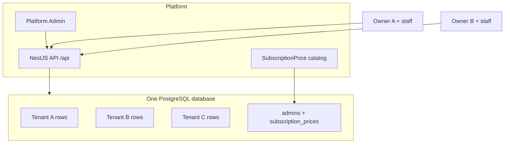

# AbiArene SaaS Architecture

Higher-level model of how this project runs as a **multi-tenant POS SaaS**: tenancy strategy, database layout, authentication, authorization, subscriptions, and realtime.

| Companion doc | Use when |
| --- | --- |
| [HANDOVER.md](./HANDOVER.md) | Ops, env, deploy |
| [role.md](./role.md) | Roles, guards, permission matrix |
| [system-workflow.md](./system-workflow.md) | Flow diagrams |
| [FRONTEND_OWNER_SUPERVISOR_MIGRATION.md](./FRONTEND_OWNER_SUPERVISOR_MIGRATION.md) | App migration for OWNER |

API prefix: `/api` · Contract: `/api/docs`

---

## 1. Product shape

AbiArene is a **B2B SaaS** for restaurants / retail POS:

- One **platform** (Softvence / AbiArene) hosts many **businesses**.
- Each business is a **tenant** (one restaurant, shop, etc.).
- Each tenant has its own staff, menu, tables, inventory, orders, payments, discounts.
- The platform has a separate **Admin** identity for plans, vouchers, and cross-tenant oversight.



---

## 2. Multi-tenancy model (what we use)

### 2.1 Industry patterns (context)

| Pattern | Idea | Pros | Cons |
| --- | --- | --- | --- |
| **Database per tenant** | Each customer gets their own DB | Strong isolation | Ops cost, migrations × N |
| **Schema per tenant** | Same server, schema `tenant_abc` | Medium isolation | Complex tooling |
| **Shared database, shared schema** (row-level) | One DB; every row tagged with `tenantId` | Simple, cheap, scales early | Must never leak queries across tenants |

### 2.2 AbiArene choice: **shared database + shared schema**

Evidence in code:

- Single Prisma datasource: `DATABASE_URL` → one PostgreSQL.
- `Tenant` is a normal table (`tenants`).
- Business tables include `tenantId` FK to `tenants` (usually `onDelete: Cascade`).
- There is **no** per-tenant connection string, no schema switching, no Prisma middleware that auto-injects `tenantId`.

**Implication for frontend / ops:** all tenants share infrastructure. Isolation is enforced in the **application layer** (JWT + explicit `where: { tenantId }` in services), not by separate databases.

```text
PostgreSQL
├── admins                          (platform-global)
├── subscription_prices             (platform-global catalog)
├── tenants                         (one row per business)
├── users                           (tenantId nullable until owner onboarding)
├── roles                           (unique name per tenantId)
├── products, menu_items, tables, orders, tickets, payments, …
└── notifications                   (tenantId optional for admin-targeted rows)
```

### 2.3 What is global vs tenant-scoped

| Global (no `tenantId`) | Tenant-scoped (`tenantId` required) | Special |
| --- | --- | --- |
| `Admin` | `Role`, `Product`, `Menu` / `MenuItem`, `Table` | `User.tenantId` optional (pre-tenant owner) |
| `SubscriptionPrice` | `Order`, `Ticket`, `Payment`, `Discount` | `Notification.tenantId` optional |
| | `SubscriptionPayment`, `SubscriptionVoucher` | |
| | `SupportTicket`, `InventoryDeletionRequest` | |

Tenant-scoped uniqueness examples:

- Role: unique `(name, tenantId)` — each tenant can have its own `MANAGER`, `OWNER`, etc.
- Product SKU: unique `(sku, tenantId)`
- Table number: unique `(tableNumber, tenantId)`
- One `Menu` per tenant (`tenantId` unique on Menu)

---

## 3. How tenant isolation works

Isolation is **defense in depth** across HTTP auth, guards, and service queries.

```mermaid
sequenceDiagram
  participant Client
  participant Jwt as JwtAuthGuard + JwtStrategy
  participant Tenant as TenantGuard
  participant Roles as RolesGuard
  participant Ctrl as Controller
  participant Svc as Service + Prisma

  Client->>Jwt: Authorization Bearer JWT
  Jwt->>Jwt: Load Admin or User, check tokenVersion, role, tenantId match
  Jwt->>Tenant: request.user = AuthUser
  alt ADMIN
    Tenant->>Roles: bypass tenantId requirement
  else @AllowWithoutTenant e.g. create tenant
    Tenant->>Roles: allow missing tenantId
  else staff
    Tenant->>Tenant: require user.tenantId; setTenant ALS
  end
  Roles->>Ctrl: @Roles match
  Ctrl->>Svc: pass user.tenantId explicitly
  Svc->>Svc: where tenantId = ...
```

### 3.1 Layer A — JWT carries tenant scope

Staff JWT payload (conceptually):

```json
{
  "sub": "<userId>",
  "name": "...",
  "email": "...",
  "tenantId": "<uuid>",
  "role": "OWNER",
  "tokenVersion": 0
}
```

Admin JWT has **no** `tenantId`:

```json
{
  "sub": "<adminId>",
  "email": "...",
  "role": "ADMIN",
  "tokenVersion": 0
}
```

On every request, `JwtStrategy` (`src/modules/auth/jwt.strategy.ts`):

1. Verifies signature / expiry (`JWT_SECRET`).
2. Reloads Admin or User from DB (`status: ACTIVE`).
3. Rejects if `tokenVersion` in JWT ≠ DB (logout / revoke).
4. For staff: rejects if JWT `tenantId` ≠ user’s current `tenantId`.
5. Resolves role from active `Role.name` or `pendingRole`.
6. Rejects if JWT `role` ≠ resolved role.

So a stolen old token after logout, role change, or tenant reassignment fails.

### 3.2 Layer B — TenantGuard

File: `src/common/guards/tenant.guard.ts` (global `APP_GUARD`).

| Case | Result |
| --- | --- |
| `@Public()` | Skip |
| `role === ADMIN` | Skip tenant requirement (cross-tenant admin APIs) |
| `@AllowWithoutTenant()` | Skip (owner before tenant exists; uploads) |
| Staff without `tenantId` | **403** `Tenant not found in token` |
| Staff with `tenantId` | Sets `TenantContextService.setTenant(tenantId)` |

### 3.3 Layer C — Explicit service filters (the real wall)

Controllers take `user.tenantId` and pass it into services. Services always query like:

```ts
where: { tenantId, id }
```

**There is no Prisma middleware** that auto-adds `tenantId`.  
`TenantContextService` (AsyncLocalStorage) is **set** by the guard but **not read** by Prisma today — isolation depends on developers always passing `tenantId`.

**Hard rule:** never expose a staff route that loads a tenant entity by primary `id` alone without also constraining `tenantId`.

### 3.4 Admin cross-tenant access

Admin routes take `:tenantId` in the path, e.g.:

- `/api/users/tenant/:tenantId`
- `/api/items/tenant/:tenantId`
- `/api/tables/tenant/:tenantId`
- `/api/tenant/all`

Admin bypasses TenantGuard’s tenant requirement; they still use JWT + `@Roles('admin')` (or manual admin checks).

---

## 4. Authentication (detailed)

### 4.1 Two identity stores

| Store | Table | Purpose |
| --- | --- | --- |
| Platform admin | `admins` | Plans, vouchers, all tenants, support replies |
| Tenant user | `users` | Owner + staff of one business |

Same endpoint authenticates both: `POST /api/auth/login` tries **Admin first**, then **User** (email + PIN).

### 4.2 Owner onboarding (no tenant yet)

```text
1. POST /api/auth/register
   → User created with pendingRole=OWNER, tenantId=null, roleId=null
   → JWT: role=OWNER, no tenantId

2. POST /api/tenant/create   (@AllowWithoutTenant + @Roles('owner'))
   → Tenant row + OWNER Role (+ optional staff roles)
   → User.roleId / User.tenantId set; pendingRole cleared

3. POST /api/auth/login again
   → JWT now includes tenantId
```

Until step 3, most tenant APIs return 403 because TenantGuard requires `tenantId`.

### 4.3 Staff login

1. Owner enables role: `PATCH /api/tenant/:tenantId/roles`.
2. Owner/Manager creates user: `POST /api/users` with `role: MANAGER | SUPERVISOR | …`.
3. Staff: `POST /api/auth/login` → JWT with `tenantId` + role.

Public POS helpers (no auth):

- `GET /api/auth/tenants` — ACTIVE tenants
- `GET /api/auth/tenants/:tenantId/users` — active users with active roles

### 4.4 Logout / revocation

`POST /api/auth/logout` increments `tokenVersion` on Admin or User.  
All previously issued JWTs for that identity fail validation. Same check on Socket.IO connect.

### 4.5 Authorization (RBAC)

After tenant context is OK, `RolesGuard` checks `@Roles('owner', 'manager', …)` against JWT `role` (case-insensitive).

Roles today:

| Role | Scope |
| --- | --- |
| `ADMIN` | Platform |
| `OWNER` | Tenant owner (create tenant, enable roles, support, uploads, credential reset, full reports, …) |
| `SUPERVISOR` | Staff: manager-like + elevated inventory + discount activate + cashier supervise |
| `MANAGER` | Day-to-day ops; inventory delete needs approval; discount drafts |
| `SERVER` / `KITCHEN` / `CASHIER` | Floor roles |

Deep detail: [role.md](./role.md).

---

## 5. Subscription / SaaS billing model

Tenancy and billing are linked on the `Tenant` row.

| Field | Meaning |
| --- | --- |
| `subscriptionStatus` | `PENDING` \| `ACTIVE` \| `EXPIRED` |
| `subscriptionStartAt` / `subscriptionEndAt` | Window |
| `subscriptionFee` | Snapshot from selected plan |
| `subscriptionCurrencyCode` | Plan / display currency context |
| `currencyCode` | Business operating currency (POS) |
| `startsWithFreeTrial` | Optional 7-day trial on create |

Flow:

```text
Admin defines SubscriptionPrice (FREE / MONTHLY / YEARLY) — global catalog
Owner picks subscriptionPriceId at tenant create
Optional: startWithFreeTrial → ACTIVE for 7 days
Else PENDING until payment
Owner/Manager: POST /tenant/subscription/pay (Stripe / Paystack / …)
Webhook / status poll → COMPLETED → subscription ACTIVE (+ window)
Admin may attach tenant-scoped SubscriptionVoucher
```

Providers and webhooks live under `/api/payments/...` and tenant subscription routes. Currency conversion for display/checkout is snapshotted on `SubscriptionPayment` for auditability.

**Note:** This is **application-level** subscription status on the tenant. It is not a separate database per paying customer.

---

## 6. Request data path (typical staff call)

Example: list inventory for the logged-in cashier’s business.

```text
Client
  Authorization: Bearer <jwt with tenantId=T1, role=CASHIER>
       │
       ▼
JwtStrategy → user { sub, tenantId: T1, role: CASHIER }
       │
       ▼
TenantGuard → OK, setTenant(T1)
       │
       ▼
RolesGuard → route allows this role (or open authenticated GET)
       │
       ▼
Controller → service.list(tenantId = T1, …)
       │
       ▼
Prisma → SELECT … FROM products WHERE tenantId = T1 …
```

Tenant B’s products never appear unless a bug omits the `tenantId` filter — hence the handover rule.

---

## 7. Realtime (Socket.IO)

Namespace: `/notifications`

- Client sends JWT (`auth.token` preferred).
- Gateway validates identity + `tokenVersion` like HTTP.
- Rooms joined:
  - `user:{userId}`
  - staff: `tenant:{tenantId}`, `tenant:{tenantId}:role:{role}`
  - admin: `admins`, `admin:{adminId}`
- Current emits go primarily to **user/admin rooms** after persisting `Notification` rows. Tenant/role rooms are prepared for fan-out patterns.

Clients should treat `notification:new` as a signal to refetch REST resources (orders, tickets, tables).

---

## 8. What this architecture is **not**

| Not used | Clarification |
| --- | --- |
| Separate DB per tenant | One `DATABASE_URL` |
| Postgres RLS policies | Isolation is app-enforced |
| Prisma `$use` tenant middleware | Manual filters only |
| Automatic tenant from ALS in queries | `TenantContextService.getTenantId()` unused in services today |
| SSO / OAuth for staff | Email + PIN JWT |
| Separate auth service | Auth module inside the same Nest app |

---

## 9. Scaling & safety considerations

**Strengths**

- Simple ops: one DB, one migration chain, one deploy.
- Fast tenant onboarding (insert `tenants` + roles + attach user).
- Shared connection pool, shared indexes.

**Risks (inherent to shared schema)**

- A missing `tenantId` in a query can leak data across businesses.
- Noisy neighbors: one large tenant shares CPU/IO with others.
- Backups/restores are all-or-nothing unless you build export tools per tenant.

**Mitigations already in place**

- JWT tenant binding + tokenVersion revoke.
- Global TenantGuard for staff.
- Cascade deletes when a tenant is removed.
- Admin vs staff separation (`Admin` table).

**Future upgrades (not implemented)**

- Prisma extension / middleware that forces `tenantId` on all tenant models.
- Postgres Row Level Security with `SET app.tenant_id`.
- Read replicas / sharding by tenant hash if growth requires it.
- Wire `TenantContextService.getTenantId()` into repositories.

---

## 10. Mental model for frontend & new backend work

1. **Tenant = business row**, not a separate database.
2. After login, staff/owner JWT **is** the tenant scope (`tenantId`).
3. Never send “pick any tenant id” from the client for staff APIs — use the token’s tenant. Admin UIs pass `:tenantId` in the path.
4. Owner without tenant can only hit `@AllowWithoutTenant` / `@Public` flows until create + re-login.
5. Roles decide **what** inside the tenant; `tenantId` decides **which** tenant’s data.

---

## 11. Key source files

| Concern | Path |
| --- | --- |
| Schema / enums | `prisma/schema.prisma` |
| Guard registration | `src/app.module.ts` |
| JWT validate | `src/modules/auth/jwt.strategy.ts` |
| Login / register | `src/modules/auth/auth.service.ts` |
| TenantGuard | `src/common/guards/tenant.guard.ts` |
| RolesGuard | `src/common/guards/roles.guard.ts` |
| Tenant ALS | `src/common/context/tenant-context.service.ts` |
| Create tenant / roles | `src/modules/tenant/tenant.service.ts` |
| Subscriptions | `src/modules/tenant/tenant-subscription.service.ts` |
| Socket auth / rooms | `src/modules/notifications/notifications.gateway.ts` |

---

## 12. One-sentence definition

**AbiArene is a single-database, row-level multi-tenant SaaS:** every business is a `Tenant` row; staff JWTs carry that `tenantId`; Nest guards and explicit Prisma filters keep each business’s data apart while platform Admins and global subscription plans sit outside tenant scope.
