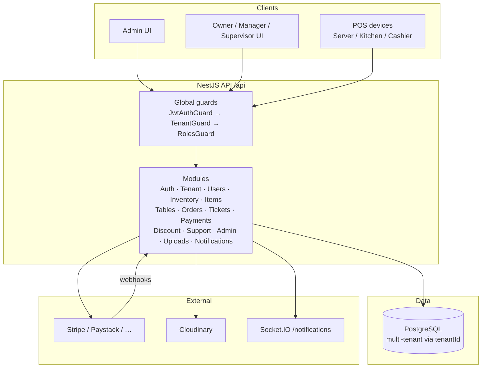
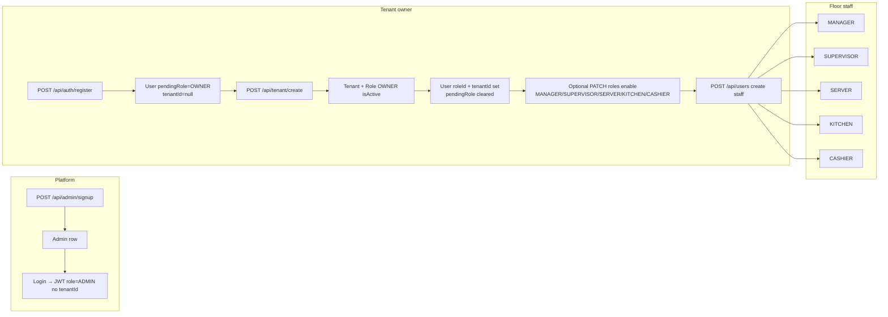
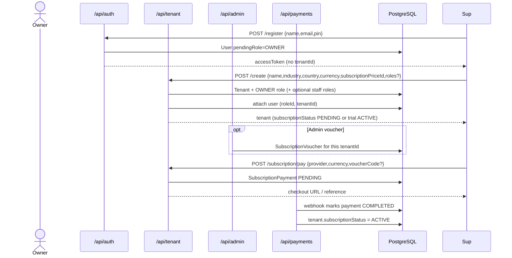
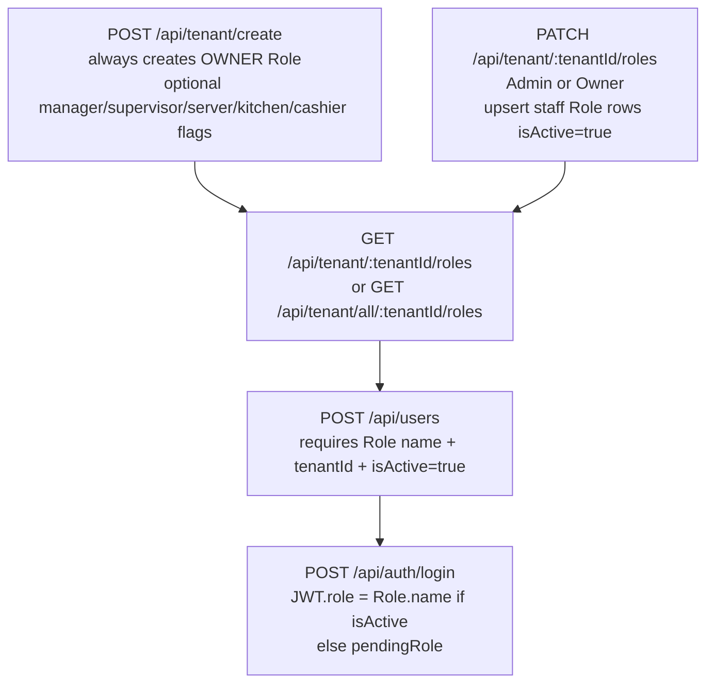
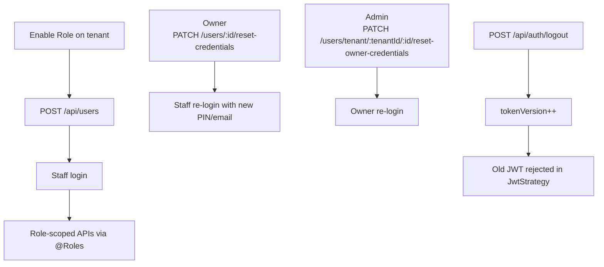
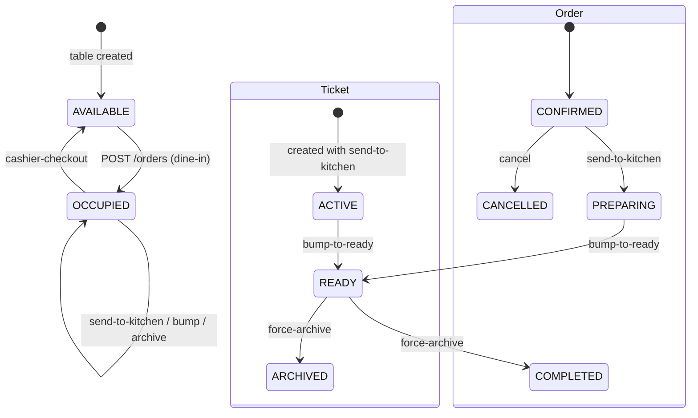
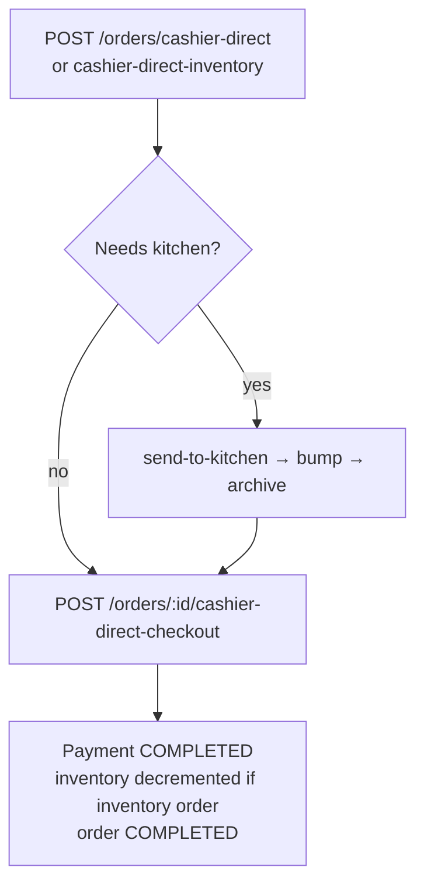
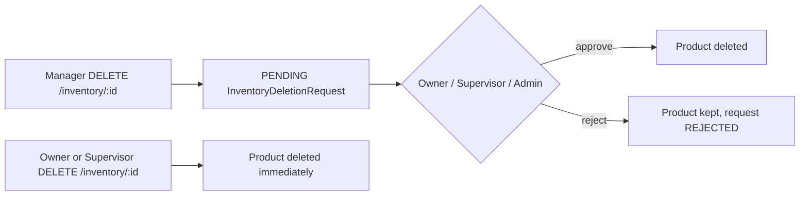

# System Workflow Diagrams

End-to-end pictures of how AbiArene runs: auth pipeline, tenant/role setup, subscription, and POS operations.

Companion docs:

- Role & permission deep-dive: [role.md](./role.md)
- Per-role API playbooks: [workflows/](./workflows/README.md)
- Ops / deployment handover: [HANDOVER.md](./HANDOVER.md)

API prefix: `/api` · Swagger: `/api/docs`

---

## 1. High-level system map



---

## 2. Request authorization pipeline

Every non-`@Public()` request runs through three global `APP_GUARD`s registered in `src/app.module.ts`:

```mermaid
flowchart TD
  A[HTTP request] --> B{JwtAuthGuard<br/>src/common/guards/jwt-auth.guard.ts}
  B -->|@Public| Z[Handler]
  B -->|no/invalid JWT| X1[401]
  B -->|valid Bearer JWT| C[JwtStrategy.validate<br/>src/modules/auth/jwt.strategy.ts]
  C -->|tokenVersion / status / role mismatch| X1
  C -->|OK → request.user = AuthUser| D{TenantGuard<br/>src/common/guards/tenant.guard.ts}
  D -->|ADMIN| E
  D -->|@AllowWithoutTenant| E
  D -->|staff without tenantId| X2[403 Tenant not found]
  D -->|staff with tenantId| E2[TenantContextService.setTenant]
  E2 --> E
  E{RolesGuard<br/>src/common/guards/roles.guard.ts}
  E -->|no @Roles| Z
  E -->|JWT role in @Roles list| Z
  E -->|role not allowed| X3[403 Forbidden]
  Z[Controller handler]
```

| Layer | File | What it decides |
| --- | --- | --- |
| JWT | `src/common/guards/jwt-auth.guard.ts` + `src/modules/auth/jwt.strategy.ts` | Who is calling; role + `tenantId` + `tokenVersion` |
| Tenant | `src/common/guards/tenant.guard.ts` | Staff must have `tenantId` (admin bypass; `@AllowWithoutTenant` for pre-tenant supervisor) |
| Roles | `src/common/guards/roles.guard.ts` | JWT `role` must match `@Roles(...)` on the route |

Decorators: `@Public()`, `@Roles()`, `@AllowWithoutTenant()`, `@CurrentUser()` — see [role.md](./role.md).

---

## 3. Identity & role lifecycle



**Important:** only **OWNER** self-registers. Supervisor / Manager / Server / Kitchen / Cashier are created under an **already-enabled** tenant `Role` row (`isActive: true`). Details in [role.md](./role.md).

---

## 4. Onboarding + subscription workflow



---

## 5. Tenant role configuration workflow

How roles become usable for staff assignment:



If a role row is missing or `isActive=false`, staff create fails with `Role not found for this tenant or inactive`, and login fails with `Invalid email/PIN or disabled role`.

---

## 6. Staff management workflow



---

## 7. Restaurant dine-in workflow



Actors by step:

| Step | Typical roles |
| --- | --- |
| Create menu / tables | Supervisor, Manager |
| Create order | Server, Manager, Supervisor, Cashier |
| Send to kitchen | Server, Manager, Supervisor, Cashier |
| Kitchen board / bump ready | Kitchen (+ Manager/Supervisor; Cashier can bump) |
| Archive ticket | Server, Kitchen, Manager, Supervisor, Cashier |
| Table checkout | Cashier, Manager, Supervisor |

---

## 8. Cashier direct-sale workflow



`tableId` stays `null`. Never use `/tables/:id/cashier-checkout` for direct orders.

---

## 9. Inventory deletion approval workflow



---

## 10. Realtime notification workflow

```mermaid
sequenceDiagram
  participant Actor as Staff action
  participant API as REST API
  participant GW as Socket.IO /notifications
  participant Client as Logged-in clients

  Actor->>API: e.g. send-to-kitchen
  API->>API: persist Notification
  API->>GW: emit notification:new to user rooms
  GW-->>Client: notification:new
  Client->>API: refetch orders/tickets/tables
```

Auth for socket: JWT in `auth.token` (preferred). Same `tokenVersion` / active checks as HTTP.

---

## 11. Role access at a glance

| Capability | ADMIN | OWNER | SUPERVISOR | MANAGER | SERVER | KITCHEN | CASHIER |
| --- | :---: | :---: | :---: | :---: | :---: | :---: | :---: |
| Platform plans / vouchers / all tenants | ✓ | | | | | | |
| Register + create tenant | | ✓ | | | | | |
| Enable tenant roles | ✓ | ✓ | | | | | |
| Create staff | ✓* | ✓ | ✓ | ✓ | | | |
| Reset staff credentials | owner only* | floor + supervisor | | | | | |
| Reports (all ranges) | | ✓ | daily/monthly | daily/monthly | | | |
| Subscription pay | | ✓ | ✓ | ✓ | | | |
| Menu / tables CRUD | ✓* | ✓ | ✓ | ✓ | patch table | | |
| Inventory delete immediate | | ✓ | ✓ | | | | |
| Inventory delete request | | | | ✓ | | | |
| Discount activate | | ✓ | ✓ | draft only | | | |
| Dine-in orders | | ✓ | ✓ | ✓ | ✓ | | ✓ |
| Kitchen board | | ✓ | ✓ | ✓ | | ✓ | |
| Direct checkout | | | | | | | ✓ |
| Support tickets | reply/close | create/chat | | | | | |

\*Admin uses cross-tenant routes under `/users/tenant/:tenantId`, `/items/tenant/:tenantId`, `/tables/tenant/:tenantId`.

Full decorator-level matrix and role-config APIs: **[role.md](./role.md)**.
